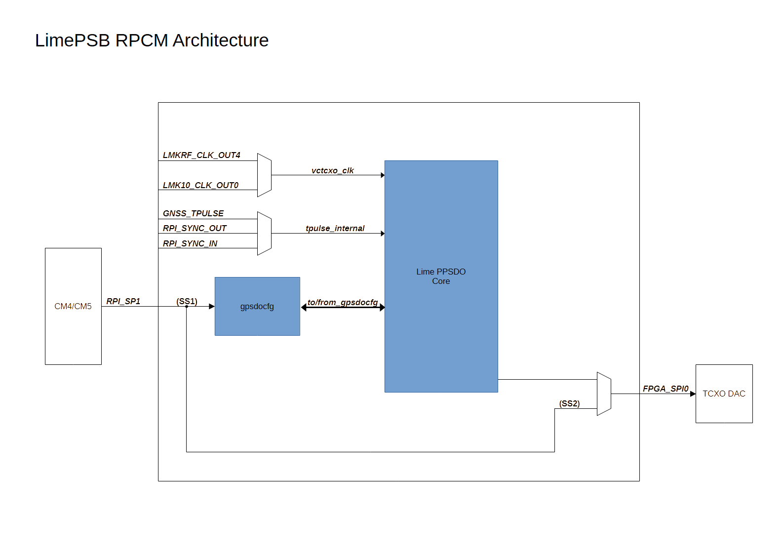
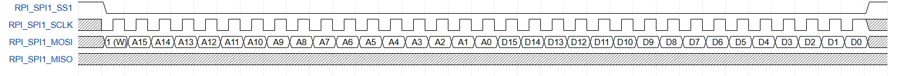
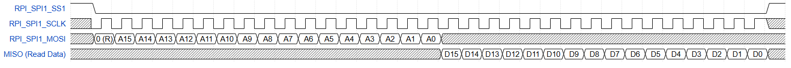

******************
LimePSB-RPCM GPSDO
******************
.. toctree::
   :maxdepth: 2
   :hidden:

Introduction
============

The LimePSB-RPCM v1.3 board features a Lattice iCE5LP4K FPGA, where the GPS Disciplined Oscillator (GPSDO) logic is implemented. 
The GPSDO reuses the standalone LimePPSDO core for core functionality, including PPS detection, frequency error calculation over 1s, 10s, and 100s intervals, and VCTCXO regulation. 
The FPGA receives a 1PPS (Pulse Per Second) signal from the GPS module or other sources, as well as a clock signal from a Voltage Controlled Temperature Compensated Crystal Oscillator (VCTCXO).

Communication between the host and the FPGA is facilitated via an SPI interface, allowing the host to enable the GPSDO module, configure its parameters, and retrieve frequency error information from the FPGA. 
Board-specific elements, such as clock source selection and SPI-based DAC control, are handled outside the core.

For detailed information on the LimePPSDO core (including the RISC-V SERV CPU control algorithm, VCTCXO TAMER module, and PPS Detector), refer to the LimePPSDO Design Description.

GPSDO design structure
======================

The GPSDO implementation on the LimePSB-RPCM board integrates the standalone LimePPSDO core with board-specific configuration and interfacing modules, as shown in :numref:`fig-block` .

Key board-specific aspects include:

* **gpsdocfg**: Configuration registers accessible via the SPI bus for enabling the module, selecting clock and PPS sources, and setting tolerances.
* **Clock Source Selection**: The RF clock input to the LimePPSDO core (rf_clk) can be selected between LMK10_CLK_OUT0 (default: 10 MHz) and LMKRF_CLK_OUT4 (30.72 MHz) 
* **PPS Source Selection**: Multiple time pulse sources can be selected for the PPS input to the LimePPSDO core, includin

  * **GNSS_TPULSE** – The 1PPS signal from the GNSS receiver
  * **RPI_SYNC_OUT** or **RPI_SYNC_IN** – Signals from the CM4/CM5 module (refer to the board schematic for details).

* **SPI DAC Control**: The 16-bit parallel DAC output from the LimePPSDO core is adapted to serial SPI for the TCXO DAC. This interface is shared with the RPI/CM4/CM5 module (using RPI_SPI1 with SS2). When the GPSDO is enabled, control is overridden by the LimePPSDO core.

Refer to the gpsdocfg register descriptions in :ref:`module-gpsdocfg` for details on controlling clock sources, PPS selection, and enabling/disabling the module.

.. _fig-block:

  
  GPSDO implementation block diagram

.. _module-gpsdocfg:

Module gpsdocfg
===============

Module gpsdocfg is simple SPI accessible module with configuration registers. SPI interface is connected to **RPI_SPI1** lines and uses **RPI_SPI1_SS1** chip select. SPI interface features:

* All registers are 16 bit wide;
* Operating mode 0 (data is captured on the clock rising edge, while data is shifted on falling edge).
* 32 serial clock cycles are required to complete read/write operations.

A write/read sequence consist of 16 bit instruction followed by a 16 bit data. The MSB of the instruction bit stream is used as SPI command where CMD = 1 for write and CMD = 0 for read. 
Basic write sequence can be found in :numref:`fig-spi-write` and read sequence in :numref:`fig-spi-read`.

.. _fig-spi-write:

  SPI write sequence  

.. _fig-spi-read:

  SPI read sequence  

Register description can be found in :numref:`tab-gps-reg`. All values should be represented in HEX number format.

.. _tab-gps-reg:

.. table:: gpsdocfg registers

  +-------------+----------------+----------+----------+-------------------+-------------------------------------------------------------------------------------------+
  | **Address** | **Def. value** | **Bits** | **Type** | **Name**          | **Description**                                                                           |
  +=============+================+==========+==========+===================+===========================================================================================+
  |                                                                             **Control**                                                                            |
  +-------------+----------------+----------+----------+-------------------+-------------------------------------------------------------------------------------------+
  |             |                | 15-4     |          | Reserved          |                                                                                           |
  |             |                +----------+----------+-------------------+-------------------------------------------------------------------------------------------+
  |             |                |          |          |                   | RPI_SYNC_IN   pin   direction:                                                            |
  |             |                |          |          |                   |                                                                                           |
  |             |                |          |          |                   | 0 – input, 1 – output (GNSS_TPULSE passtrough)                                            |
  |             |                | 4        | R/W      | RPI_SYNC_IN_DIR   |                                                                                           |
  |             |                |          |          |                   | NOTE: To set pin to output, ensure that TPULSE_SEL is not set to 10   (binary).           |
  |    0x0000   |                |          |          |                   |                                                                                           |
  |             |                |          |          |                   | TPULSE_SEL = 10 overrides RPI_SYNC_IN_DIR setting and forces the pin to   input mode.     |
  |             |                +----------+----------+-------------------+-------------------------------------------------------------------------------------------+
  |             |                | 3-2      | R/W      | TPULSE_SEL        | 00 – GNSS_TPULSE, 01 – RPI_SYNC_OUT,   10 – RPI_SYNC_IN, 11 – Reserved                    |
  |             |                +----------+----------+-------------------+-------------------------------------------------------------------------------------------+
  |             |                | 1        | R/W      | CLK_SEL           | 1 -    LMK10_CLK, 0 – LMKRF_CLK                                                           |
  |             |                +----------+----------+-------------------+-------------------------------------------------------------------------------------------+
  |             |                | 0        | R/W      | EN                | 1 -  Enabled, 0 – Disabled                                                                |
  +-------------+----------------+----------+----------+-------------------+-------------------------------------------------------------------------------------------+
  |                                                                          **Tune settings**                                                                         |
  +-------------+----------------+----------+----------+-------------------+-------------------------------------------------------------------------------------------+
  |    0x0001   |                | 15-0     | R/W      | PPS_1S_TARGET_L   |                                                                                           |
  +-------------+----------------+----------+----------+-------------------+ Frequency   target value in 1s period (32 bit value, L – lower 16 b, H – upper 16b).      |
  |    0x0002   |                | 15-0     | R/W      | PPS_1S_TARGET_H   |                                                                                           |
  +-------------+----------------+----------+----------+-------------------+-------------------------------------------------------------------------------------------+
  |    0x0003   |                | 15-0     | R/W      | PPS_1S_ERR_TOL    | Error   tolerance value in 1s period (16 bit value).                                      |
  +-------------+----------------+----------+----------+-------------------+-------------------------------------------------------------------------------------------+
  |    0x0004   |                | 15-0     | R/W      | PPS_10S_TARGET_L  |                                                                                           |
  +-------------+----------------+----------+----------+-------------------+ Frequency   target value in 10s period (32 bit value, L – lower 16 b, H – upper   16b).   |
  |    0x0005   |                | 15-0     | R/W      | PPS_10S_TARGET_H  |                                                                                           |
  +-------------+----------------+----------+----------+-------------------+-------------------------------------------------------------------------------------------+
  |    0x0006   |                | 15-0     | R/W      | PPS_10S_ERR_TOL   | Error   tolerance value in 10s period (16 bit value).                                     |
  +-------------+----------------+----------+----------+-------------------+-------------------------------------------------------------------------------------------+
  |    0x0007   |                | 15-0     | R/W      | PPS_100S_TARGET_L |                                                                                           |
  +-------------+----------------+----------+----------+-------------------+ Frequency   target value in 100s period (32 bit value, L – lower 16 b, H – upper   16b).  |
  |    0x0008   |                | 15-0     | R/W      | PPS_100S_TARGET_H |                                                                                           |
  +-------------+----------------+----------+----------+-------------------+-------------------------------------------------------------------------------------------+
  |    0x0009   |                | 15-0     | R/W      | PPS_100S_ERR_TOL  | Error   tolerance value in 100s period (16 bit value).                                    |
  +-------------+----------------+----------+----------+-------------------+-------------------------------------------------------------------------------------------+
  |                                                                    **Current tune error values**                                                                   |
  +-------------+----------------+----------+----------+-------------------+-------------------------------------------------------------------------------------------+
  |    0x000A   |      0000      | 15-0     | R        | PPS_1S_ERR_L      |                                                                                           |
  +-------------+----------------+----------+----------+-------------------+ Error   count in 1s period (32 bit signed value, L – lower 16 b, H – upper 16b)           |
  |    0x000B   |      0000      | 15-0     | R        | PPS_1S_ERR_H      |                                                                                           |
  +-------------+----------------+----------+----------+-------------------+-------------------------------------------------------------------------------------------+
  |    0x000C   |      0000      | 15-0     | R        | PPS_10S_ERR_L     |                                                                                           |
  +-------------+----------------+----------+----------+-------------------+ Error   count in 10s period (32 bit signed value, L – lower 16 b, H – upper 16b)          |
  |    0x000D   |      0000      | 15-0     | R        | PPS_10S_ERR_H     |                                                                                           |
  +-------------+----------------+----------+----------+-------------------+-------------------------------------------------------------------------------------------+
  |    0x000E   |      0000      | 15-0     | R        | PPS_100S_ERR_L    |                                                                                           |
  +-------------+----------------+----------+----------+-------------------+ Error   count in 100s period (32 bit signed value, L – lower 16 b, H – upper 16b)         |
  |    0x000F   |      0000      | 15-0     | R        | PPS_100S_ERR_H    |                                                                                           |
  +-------------+----------------+----------+----------+-------------------+-------------------------------------------------------------------------------------------+
  |                                                                             **Status**                                                                             |
  +-------------+----------------+----------+----------+-------------------+-------------------------------------------------------------------------------------------+
  |    0x0010   |      0000      | 15-0     | R        | DAC_TUNED_VAL     | Tuned DAC value                                                                           |
  +-------------+----------------+----------+----------+-------------------+-------------------------------------------------------------------------------------------+
  |             |                | 15-9     |          | Reserved          |                                                                                           |
  |             |                +----------+----------+-------------------+-------------------------------------------------------------------------------------------+
  |             |                | 8        | R        | TPULSE_ACTIVE     | 0 – Timepulse is not active, 1 –   Timepulse is active                                    |
  |             |                +----------+----------+-------------------+-------------------------------------------------------------------------------------------+
  |             |                |          |          |                   | 0000  –    tune disabled or lowest accuracy,                                              |
  |             |                |          |          |                   |                                                                                           |
  |    0x0011   |      0000      |          |          |                   | 0001 – 1s tune ,                                                                          |
  |             |                | 7-4      | R        | ACCURACY          |                                                                                           |
  |             |                |          |          |                   | 0010 – 2s tune ,                                                                          |
  |             |                |          |          |                   |                                                                                           |
  |             |                |          |          |                   | 0011 – 3s tune (highest accuracy).                                                        |
  |             |                +----------+----------+-------------------+-------------------------------------------------------------------------------------------+
  |             |                | 3-0      | R        | STATE             | 0000 – Coarse Tune, 0001 – Fine tune                                                      |
  +-------------+----------------+----------+----------+-------------------+-------------------------------------------------------------------------------------------+

LimePPSDO Core Integration
==========================

The GPSDO leverages the standalone LimePPSDO core for all core functionality, including:

*	**PPS Detector** for validating the incoming 1PPS signal. 
* **VCTCXO TAMER** for measuring frequency errors over 1s, 10s, and 100s intervals using 32-bit counters. 
*	**RISC-V SERV CPU** for running the control algorithm (initialization, coarse tune to ±1 Hz precision using 1s interval, and fine tune to ~0.01 Hz precision using all intervals).

The core's sys_clk is driven by the FPGA system clock (e.g., 6 MHz default), and rf_clk is from the selected board clock source. 

Configurations (targets and tolerances) are set via gpsdocfg registers and forwarded to the core's parallel inputs. 

The core's 16-bit parallel DAC output is serialized via SPI for the board's TCXO DAC. Status outputs (e.g., pps_active, state, accuracy, errors, dac_tuned_val) are readable via gpsdocfg.
When enabled (gpsdocfg 0x0000[0] = 1), the core takes over DAC control. For algorithm details, including two-point line equations for coarse/fine tuning and error adjustment formulas, refer to the LimePPSDO Design Description.

Getting started with GPSDO
==========================

This chapter provides a short guide on how to use the GPSDO implementation in LimePSB-RPCM v1.3 board. It covers the necessary steps to configure and operate the module.

1.	Connect GPS antenna to GPS/GNSS(J44) connector 
2.	Configure PPS_TARGET and PPS_ERR_TOL registers in gpsdocfg module (see register description in :numref:`tab-gps-reg`). Values can be calculated:

  .. math::

    PPS\_TARGET = f * s;  

  .. math::

    PPS\_ERROR\_TOL = round(s * f * ppb * 10^{-9});
    
  where s – time in seconds, f – frequency in Hz, ppb – required stability in points per billion

  Example register values calculated for 30.72MHz VCTCXO clock and 20 ppb error tolerance:

  | 0x0001 = 0xC000
  | 0x0002 = 0x01D4
  | 0x0003 = 0x0001
  | 0x0004 = 0x8000
  | 0x0005 = 0x124F
  | 0x0006 = 0x0006
  | 0x0007 = 0x0000
  | 0x0008 = 0xB71B
  | 0x0009 = 0x003D

3.	Enable VCTCXO tamer module by setting **0x0000[0]** register bit to 1.
4.	LED7 should start blinking in red color once per second, this indicates that there is active 1PPS signal and VCTCXO TAMER module is enabled. 
5.	Observe VCTCXO TAMER module tune state and accuracy register values of address **0x0011**, after few minutes it should become **0x0031** (fine tune state and 3s tune highest accuracy, see :numref:`tab-gps-reg` for register description).

A test script (test/test_gpsdo.py) is provided with the project repository to directly control and monitor GPSDO functionality via SPI. 
It supports configuring targets/tolerances (using ppm; note 1 ppm = 1000 ppb), enabling/disabling, resetting, dumping registers, and real-time monitoring of errors, DAC value, state, accuracy, and PPS activity. 
Ensure SPI access (e.g., via Raspberry Pi on bus 1, device 1 at 500 kHz).

**Example Commands**:

*	Enable GPSDO with default 30.72 MHz clock and 0.1 ppm (100 ppb) tolerance: 

  .. code:: bash

    python3 test_gpsdo.py --enable 

*	Enable with 10 MHz clock and 0.02 ppm (20 ppb) tolerance: 

  .. code:: bash

    python3 test_gpsdo.py --enable --clk-freq 10 --ppm 0.02

*	Monitor regulation loop indefinitely (press Ctrl+C to stop): 

  .. code:: bash

    python3 test_gpsdo.py --check

*	Dump all registers once:

  .. code:: bash

    python3 test_gpsdo.py --dump

*	Reset GPSDO (disable then re-enable after 2s delay): 

  .. code:: bash

    python3 test_gpsdo.py --reset 

*	Disable GPSDO: 

  .. code:: bash

    python3 test_gpsdo.py --disable

